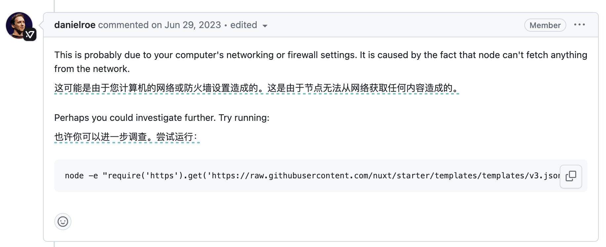

# ClashXPremium增强模式的好处

最近在学习 Nuxt3 ，在初始化安装项目模版时遇到了无法下载的问题如下：

```text
Error: Failed to download template from registry: fetch failed
```

在 Nuxt 开源库 issues 中有关于此话题的展开讨论：[#21853](https://github.com/nuxt/nuxt/issues/21853)

其中 Nuxt 创始人 [danielroe](https://github.com/danielroe) 是这样说的：


他提供给我们一行代码通过 node 进行 https 请求关于 Nuxt 的元数据文件的代码

```bash
node -e "require('https').get('https://raw.githubusercontent.com/nuxt/starter/templates/templates/v3.json')"
```

> **我们尝试运行可能会发现进程卡住了一直在请求网络数据，直到超时停止。**

如果您遇到了这个问题，您需要做什么？

1. **DNS环境污染**
   - 尝试 ping raw.githubusercontent.com。看有没有丢包，如果有的话就说明DNS环境污染问题，去 `/etc/hosts` 手动记录网站 ip。
   - 修改网络 DNS，Google 运营商为 8.8.8.8
2. **设置网络代理**
   - Mac可以在 ~/.bashrc ~/.bash_profile 任意一个，或 ~/.zshrc 中配置代理信息，如果在前两个文件任意一个中配置。
   - 都是同样的道理，因为我们一般都是打开 zsh shell 输命令，所以为了方便可以在 .zshrc 文件中调用 source ~/.bashrc 或 source ~/.bash_profile，这样就不必每次打开终端都手动输入使其生效。
   - 例如：`export https_proxy=http://127.0.0.1:7890 http_proxy=http://127.0.0.1:7890 all_proxy=socks5://127.0.0.1:7890`

---

完成前面两步操作后，我们可以进行测试看看效果如何：

> 很显然，依然无法通过 node 请求数据，（除非在 js 脚本中设置代理，但这样很麻烦），
>
> 反而通过刚才的配置已经解决了使用CURL请求失败的问题。

```bash
node -e "require('https').get('https://raw.githubusercontent.com/nuxt/starter/templates/templates/v3.json')"
^C

curl https://raw.githubusercontent.com/nuxt/starter/templates/templates/v3.json
{
  "name": "v3",
  "defaultDir": "nuxt-app",
  "url": "https://nuxt.com",
  "tar": "https://codeload.github.com/nuxt/starter/tar.gz/refs/heads/v3"
}
```

**那么这时候，给大家介绍一个我在用 ClashXPremium 发现的很强的功能 ---> 增强模式**

- 点击顶部栏中Clash图标，在列表中单击增强模式即可切换其状态进行开启或关闭。

**启用它后即便我们不配置 https_proxy、http_proxy 代理，也能正常让所有请求走代理，而不仅仅局限于 browser 端。**
