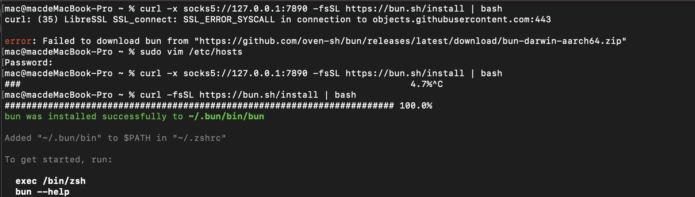

# 使用 curl 安装 Bun 时遇到的问题


## command
curl 安装 Bun 的命令：`curl -fsSL https://bun.sh/install | bash`

### command analysis

- 最终请求的是 github 一个 release 包：https://github.com/oven-sh/bun/releases/latest/download/bun-darwin-aarch64.zip ， 
- 其实无法通过 curl 安装也可以自行下载压缩包，最后在 `~/.zshrc` 配置一下安装路径，奈何这人太倔强，喜欢钻牛角尖。
- 之所以通过 curl 请求 https://bun.sh/install ，就可以下载bun官方发布的 release ，其实是因为在后端做了跳板反向代理到了指定的 domain


## 报错汇总
```text
curl: (35) Recv failure: Operation timed out
curl: (56) Failure when receiving data from the peer
curl: (35) LibreSSL SSL_connect: SSL_ERROR_SYSCALL in connection to objects.githubusercontent.com:443
```

## 本机环境
> 在分析过程之前先说明一下自己现有的一些基础信息，如果有相同情况也可以很好的和你核对，拿我做参考。
```text
Chip: Apple M1 Pro
Memory: 16 GB
System Version: macOS Sonoma 14.0

file - /etc/hosts
##
# Host Database
#
# localhost is used to configure the loopback interface
# when the system is booting.  Do not change this entry.
##
127.0.0.1	localhost
255.255.255.255	broadcasthost
::1             localhost

# raw.githubusercontent.com
185.199.108.133 raw.githubusercontent.com
```

## 错误复现
1. 在以上本机环境之下若直接请求，会出现[报错汇总](#报错汇总)中前两条任意一条。
2. 若使用代理，将会报错第三条，届时我们需要手动将 `objects.githubusercontent.com` 所对应的ip添加到 `/etc/hosts` 做记录
   - 通过curl请求+代理时命令：`curl -x socks5://127.0.0.1:7890 -fsSL https://bun.sh/install | bash`
   - 比如你 ping github.com 被丢包，那么你需要手动将 github.com 对应的 ip 地址做记录，这是因为国内DNS环境污染问题导致。
3. 实际上在安装bun时不需要设置代理，可能是因为 github release cdn 的原因。。。


**拿nuxt3案例测试：**

【✘】无法通过`node -e "require('https').get('https://raw.githubusercontent.com/nuxt/starter/templates/templates/v3.json')"`正常请求数据。

【✘】无法通过`curl https://raw.githubusercontent.com/nuxt/starter/templates/templates/v3.json` 正常请求数据。

【✔️】配置代理才能请求数据：`curl -x socks5://127.0.0.1:7890 https://raw.githubusercontent.com/nuxt/starter/templates/templates/v3.json`


## 最后
:::warning 总结
任何情况下先直连做请求，若无法通过尝试添加hosts，再次尝试，不行再使用代理。

其实通过浏览器能访问外网也是有VPN代理。
:::

&nbsp;最后我们的/etc/hosts文件应该是这样的（省略不重要信息）
```text
# raw.githubusercontent.com
185.199.108.133 raw.githubusercontent.com

# github
140.82.113.4 github.com

# objects.githubusercontent.com
185.199.109.133 objects.githubusercontent.com
```



推荐一个 IP 识别工具：https://www.ipaddress.com/
