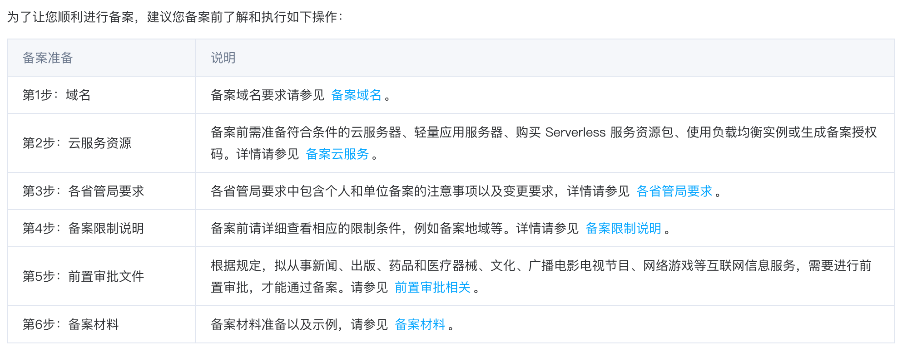
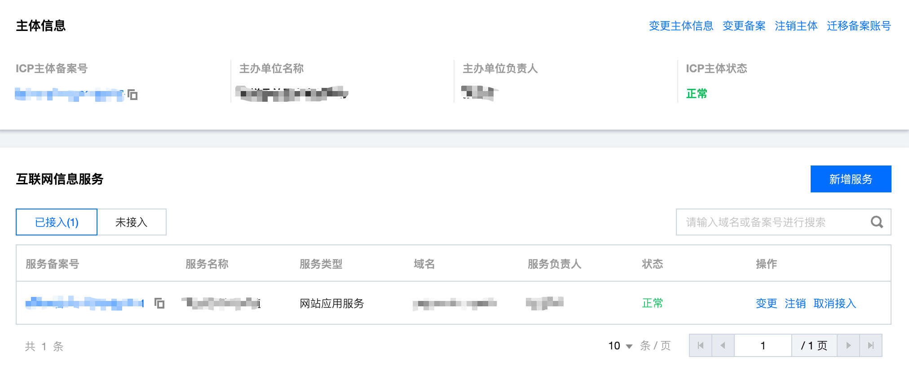

# 域名备案 {#domain-name-filing}

&nbsp;&nbsp;不止是网站，在国内从事互联网行业无论做什么，都需要备案。那些不备案心虚搞灰产或材料自身条件不足的确实无法备案。

备案不止是对商家合法性一个交代，更是对客户一个交代，能够很大程度阻止上当受骗。

---

下面将循循渐进为大家讲解如何备案：

[[TOC]]

## 一、选择厂商 {#optional-profile}

腾讯云，阿里云，华为云，天翼云等等都是可以的，本篇文章实用腾讯云来介绍。

## 二、购买域名 {#buy-domains}

&nbsp;&nbsp;域名的价格与域名谐音，长度，民族传统息息相关。我们应该根据自己的产品选择合适的域名，通常刚入手比较贵的域名在续费的时候会非常贵，所以要么一次性买好多年，要么就请选择其他适合自己的域名，否则得不偿失。

腾讯云购买域名请前往：https://buy.cloud.tencent.com/domain

购买之后可以在[我的域名](https://console.cloud.tencent.com/domain/all-domain/all)中看到详细信息。

腾讯云比较麻烦的一点是登录 `token` 很容易过期，需要频繁重新登录。。。

## 三、前提须知 {#advance-informed}

### 1. 什么情况下不需要备案？

硬性条件：不能购买中国内陆服务器
::: details 如果您在中国大陆以外地区购买服务器，就近选择取决于您的需求和预期的网络性能。以下是一些就近购买服务器的建议，请点开查看
亚洲地区：如果您的目标受众主要位于亚洲地区，可以考虑选择香港、新加坡、日本或韩国等地的服务器。这些地区与中国大陆相对较近，网络延迟较低。

欧洲地区：如果您的目标受众主要位于欧洲地区，可以考虑选择德国、英国、法国或荷兰等地的服务器。这些地区与中国大陆之间有较好的网络连接。

美洲地区：如果您的目标受众主要位于美洲地区，可以考虑选择美国东、西海岸的服务器。这些地区在网络上与中国大陆之间有较好的互联连接。
:::

与需要被解析的域名没有关系。

### 2. 什么情况下必须备案？

情况：购买中国内陆服务器必须备案才能上域名，不然服务器随时会被封停。

与需要被解析的域名没有关系。

### 3. 不备案的坏处

::: details 列出有点多，请点看查看
不备案相当于您与国内互联网市场脱离，您的产品面向海外。

不备案您将无法在国内几乎所有的开放平台接入到您的项目。就算备案大部分开放平台也只为企业用户开放全功能，当然也会有些小作坊支持个人，

> &nbsp;&nbsp;例如：对接支付，会有一些聚合支付平台，交98会员费或者支付费率高到8%，聚合平台我只推荐一个，他家费率0.38%，不需要交会员费，不过有额度这么个东西，注册账号送500提现额度，支持免签类型或办理签证进件，也是做海外支付对接的：[支付FM](https://www.zhifux.com/)

不备案可以使用ip的形式进行访问，不过是会禁掉http和https所用端口80,443的，也就是说不能输入域名直接访问网站。

当然，备案与否与SSL没有关系，依旧可以申请SSL证书，在腾讯云中SSL免费证书不支持IP类型，需要购买付费证书。个人单域名证书价格：532rmb，企业单域名证书价格：2470rmb。
:::

### 4. 产品类型决定备案所需资质

企业：工商营业执照（统一社会信用代码证书）、组织机构代码证书、外国企业常驻代表机构登记证，更多请查看：[单位备案所需材料](https://cloud.tencent.com/document/product/243/18914#.E5.8D.95.E4.BD.8D.E5.A4.87.E6.A1.88.E6.89.80.E9.9C.80.E6.9D.90.E6.96.99)

个人：负责人个人身份证件

## 四、准备材料 {#prepare-material}

## 五、开始备案 {#start-filing}

为域名备案请前往：https://console.cloud.tencent.com/beian/manage

&nbsp;&nbsp;如果需要域名备案的服务器不在相关备案平台将无法查找并选择服务器进行备案，此时需要去淘宝购买授权码（如果在腾讯云备案可以搜索”腾讯云授权码“），在账号中兑换拿到的授权码才行，授权吗有效期七天，备案足以。

### 1. 备案授权码

个人账号无法生成备案授权码，需使用企业实名认证账号并已购买中国内地（大陆）服务器才能进行生成备案授权码。

备案授权码是由服务器生成的用于备案的授权凭证，实际指向该服务器的 IP。

### 2. 审批

初审：1～2天，在腾讯云先经过工作人员初次核查，避免提交到管局后因错误反复驳回。

提交管局：7～8天，由腾讯云提交管局正式审核。
 
 

总结：备案整个流程至少要留两个星期时间。

## 六、备案成功 {#filing-success}

域名备案成功会通过邮件，短信通知，可以在[我的域名](https://console.cloud.tencent.com/beian/manage)中查看。

