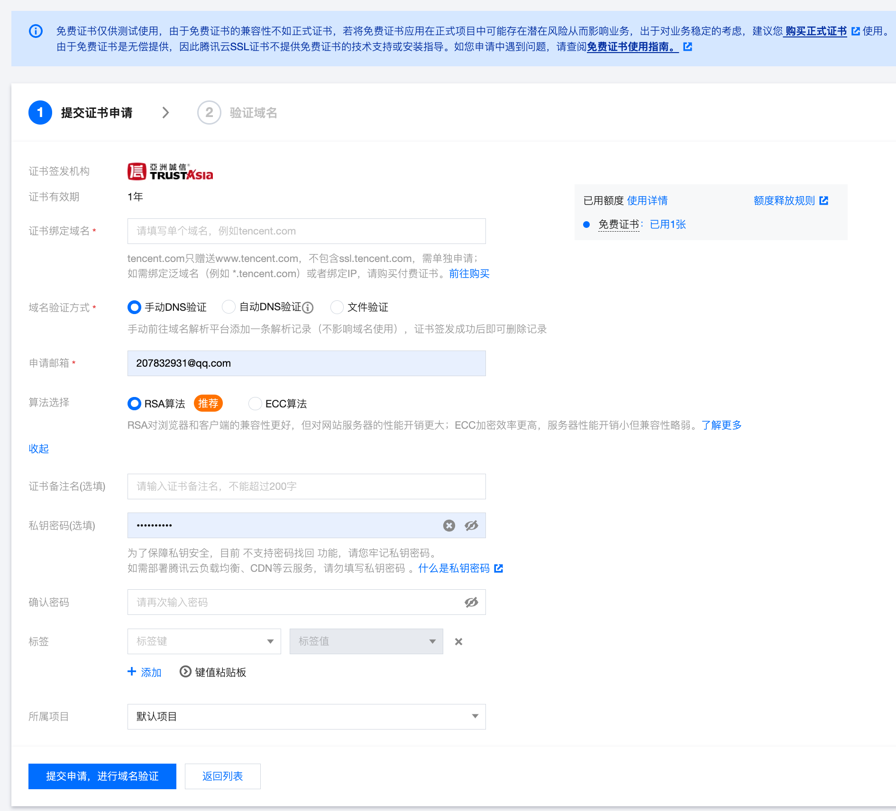

# 使用Docker、Nginx技术配置SSL {ssl-license-config}

SSL（Secure Sockets Layer）是一种安全套接层协议，其作用是确保在互联网上进行的敏感信息传输的安全性和完整性。SSL的主要作用如下：
::: details 详情

1. 加密数据传输：SSL使用加密算法对传输的数据进行加密，使得第三方无法直接读取或窃取传输的数据内容。这对于敏感信息如信用卡号码、登录凭证等的传输非常重要，以防止数据被黑客拦截并进行恶意使用。

2. 身份验证与认证：SSL通过使用数字证书来验证服务器的身份，并使用公钥加密技术与私钥解密技术确保通信双方的身份可信。这样，用户可以确认他们正在与合法的服务器通信，而不是一个冒充的或恶意的实体，从而防止钓鱼、中间人攻击等安全威胁。

3. 数据完整性保护：SSL使用消息认证码（MAC）来保证数据的完整性，即检查数据是否在传输过程中被篡改或损坏。如果数据在传输过程中被修改，接收方将会发现并拒绝接受数据，从而确保数据的完整性。

4. 改善搜索排名：搜索引擎（如Google）已经将网站的SSL证书作为搜索排名的一个因素，即使用SSL加密的网站在搜索结果中更有可能获得更高的排名。这鼓励网站采用SSL来提供更安全的连接。

总的来说，SSL提供了加密、身份验证和数据完整性保护等功能，确保在互联网上进行敏感信息传输时的安全性。无论是电子商务、在线银行业务还是登录账户，使用SSL都能提供一定程度的保护，增强用户信任并防止数据被拦截或篡改。
:::

本篇技术相关关键词：docker、nginx、ssl

---

[[TOC]]

## 一、选择厂商 {#optional-profile}

腾讯云，阿里云，华为云，天翼云等等都是可以的，本篇文章实用腾讯云来介绍。

## 二、申请免费 SSL 证书 {#free-ssl-certificate}

我的证书控制面板：https://console.cloud.tencent.com/ssl



腾讯这边付费证书少了都要上千，消费不起，暂时不考虑

> 提交申请后两天内就能通过。

## 三、SSL证书部署 {#ssl-deploy}

### 1. 下载证书压缩包

SSL证书下发后从管理后台下载证书压缩包，选择：Nginx（适用大部分场景）（pem文件、crt文件、key文件），后面使用Nginx安装证书

假设我们的域名是：cloud.tencent.com，那么下载后的压缩包名为：cloud.tencent.com_nginx

其内部包含四个文件：

- `cloud.tencent.com_bundle.crt` 证书文件
- `cloud.tencent.com_bundle.pem` 证书文件（可以忽略）
- `cloud.tencent.com.key` 私钥文件
- `cloud.tencent.com.csr` CSR文件

::: warning 说明
CSR 文件是申请证书时由您上传或系统在线生成的，提供给 CA 机构。安装时可忽略该文件。
:::

### 2. 传输到服务器

我们只需要用到`*.crt`和`*.key`文件，因此只传这两个

```shell
scp /Users/yourname/Downloads/cloud.tencent.com_bundle.crt root@xxx.xx.xxx.xx:/server/nginx/cert/
scp /Users/yourname/Downloads/cloud.tencent.com.key root@xxx.xx.xxx.xx:/server/nginx/cert/
```

注意：拷贝到哪个位置无关紧要，后面docker run运行容器时通过-v指定路径。

## 四、容器部署 {#container-deploy}

Docker安装就不介绍了，与本篇中心点不符

### 1. 下载镜像

```shell
docker pull nginx:latest
```

### 2. 测试镜像

```shell
docker run --name nginx-1 -p 8080:80 -d nginx
docker ps
```


### 3. 创建挂载目录

```shell
# 创建www目录
mkdir -p /server/nginx/html
# 创建日志目录
mkdir -p /server/nginx/logs
# 创建配置目录
mkdir -p /server/nginx/conf
# 创建cert目录
mkdir -p /server/nginx/cert
```

`-p`: 递归形式创建目录；

### 4. 完成挂载基础部署

```shell
## 拷贝配置文件
docker cp nginx-1:/etc/nginx/nginx.conf /server/nginx/conf/nginx.conf

## 拷贝完配置文件后需要把测试运行的容器停掉，然后再删除容器
docker stop nginx-1
docker rm nginx-1

## 映射容器目录
docker run -d -p 80:80 -p 443:443 --name nginx-1 \
-v /server/nginx/html:/usr/share/nginx/html \
-v /server/nginx/conf/nginx.conf:/etc/nginx/nginx.conf \
-v /server/nginx/logs:/var/log/nginx \
-v /server/nginx/cert:/etc/nginx/cert \
--restart=always \
nginx:latest

## 查看容器是否在运行
docker ps

## 如果因为权限问题，需要在docker run后面加上--privileged=true这个参数
```

## 五、nginx.conf配置 {#nginx-configuration}

在`/server/nginx/conf/nginx.conf`文件`server`节点加入以下配置

```shell
listen 443 ssl; #侦听443端口，用于SSL
server_name  cloud.tencent.com;
access_log  /var/log/nginx/host.access.log  main;
# 注意证书文件名字和位置，是从/etc/nginx/下开始算起的
ssl_certificate cert/cloud.tencent.com.crt;
ssl_certificate_key cert/cloud.tencent.com.key;
ssl_session_timeout 5m;
ssl_protocols TLSv1 TLSv1.1 TLSv1.2;
ssl_ciphers ECDHE-RSA-AES128-GCM-SHA256:HIGH:!aNULL:!MD5:!RC4:!DHE;
ssl_prefer_server_ciphers on;
client_max_body_size 1024m;
```

## 六、检查配置 {#check-configuration}

为了验证配置文件是否正确，可以通过如下命令：

```shell
# 进入容器
docker exec -it nginx-1 /bin/bash
# 检查配置文件
nginx -t
```

## 七、启动服务 {#enable-server}

可以使用docker restart/start/stop来控制容器内nginx，也可以在容器正在运行时进入内部执行nginx命令

```shell
# 重新载入配置文件
nginx -s reload
# 重启 Nginx
nginx -s reopen
# 停止 Nginx
nginx -s stop
```

## 八、参考文献 {#references}

[Docker安装nginx以及部署](https://www.shenmazong.com/blog/1402091109054885888)

[Nginx 安装 SSL 配置 HTTPS 超详细完整全过程(不使用Docker)](https://segmentfault.com/a/1190000022673232#item-1-1)
