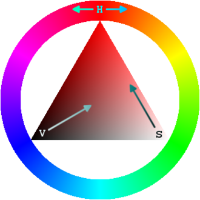
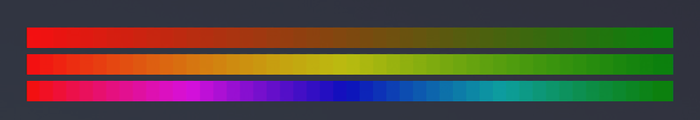

# gradient-string

<div style="display:flex; margin: 10px 0">
    <a href="https://github.com/bokub/gradient-string/actions/workflows/run.yml"></a>
    <a style="margin-left: 4px;" href="https://www.npmjs.com/package/gradient-string"></a>
    <a style="margin-left: 4px;" href="https://codecov.io/gh/bokub/gradient-string"></a>
    <a style="margin-left: 4px;" href="https://www.npmjs.com/package/gradient-string"></a>
    <a style="margin-left: 4px;" href="https://github.com/sindresorhus/xo"></a>
    <a style="margin-left: 4px;" href="https://github.com/sindresorhus/awesome-nodejs"></a>
</div>

<!-- [![Build Status][build-src]][build-href]
[![Version][version-src]][version-href]
[![Codecov][codecov-src]][codecov-href]
[![Downloads][downloads-src]][downloads-href]
[![XO code style][xo-src]][xo-href]
[![Mentioned in Awesome Node.js][awesome-src]][awesome-href] -->

> 在控制台输出漂亮的颜色渐变信息


---

[[TOC]]

## 安装 {#install}

```shell
npm i gradient-string
```

## 用法 {#usage}

```js
const gradient = require("gradient-string");

console.log(gradient("cyan", "pink")("Hello world!"));
```

### 初始化渐变函数 {#initialize-a-gradient}

```javascript
// 传入参数列表
let coolGradient = gradient("red", "green", "blue");

// 传入数组
let coolGradient = gradient(["#FF0000", "#00FF00", "#0000FF"]);
```

使用 TinyColor 解析这种颜色或查看[各种解析格式](#accepted-string-input)。

```javascript
let coolGradient = gradient([
  tinycolor("#FFBB65"), // tinycolor object
  { r: 0, g: 255, b: 0 }, // RGB object
  { h: 240, s: 1, v: 1, a: 1 }, // HSVa object
  "rgb(120, 120, 0)", // RGB CSS string
  "gold", // named color
]);
```

### 使用渐变函数 {#use-a-gradient}

```javascript
let coolString = coolGradient("This is a fancy string!");
console.log(coolString);
```

## 内置渐变 {#built-in-gradient}

### 用法

```javascript
const gradient = require("gradient-string");

// 使用rainbow渐变
console.log(gradient.rainbow("I love gradient-strings!"));
```

### 有效内置渐变 {#available-built-in-gradients}

<br>


## 多行渐变 {#multi-ling-gradients}

在某些情况下，您可能希望对长文本(或ASCII艺术)的每一行应用相同的水平渐变。

您可以使用 `multiline()` 渐变方法来确保颜色垂直对齐。

```javascript
const gradient = require("gradient-string");

// 在每一行使用相同渐变
let duck = gradient("orange", "yellow").multiline(
  ["  __", "<(o )___", " ( ._> /", "  `---'"].join("\n"),
);
console.log(duck);

// 使用内置渐变别名（alias）工作
gradient.atlas.multiline("Multi line\nstring");

// 使用高级选项工作
gradient("cyan", "pink").multiline("Multi line\nstring", {
  interpolation: "hsv",
});
```

## 高级渐变 {#advanced-gradients}

还有更高级的渐变定制选项，如自定义颜色停止位，或选择颜色插值。

### 自定义颜色停止位 {#custom-color-stops}

默认情况下，渐变停止位是等距分布的。

你也可以明确指出每个颜色停止位（`0`到`1`之间）的位置，使用以下语法：

```javascript
let coolGradient = gradient([
  { color: "#d8e0de", pos: 0 },
  { color: "#255B53", pos: 0.8 },
  { color: "#000000", pos: 1 },
]);
```

### 颜色插值 {#color-interpolation}

当使用渐变时，实际上您可以添加第二个参数选择如何生成颜色。

下面是完整的 gradient API:

#### myGradient(text, [options])

---

##### text

- Type: `string` - 你想要的颜色字符串。

##### options

- Type: `Object`

###### options.interpolation

- Type: `string`
  1. 渐变可以使用RGB或HSV插值生成。HSV通常产生更明亮的颜色。
  2. 'interpolation'可以设置为'rgb'用于rgb插值，或'HSV'用于HSV插值。
  3. 默认为 `rgb`，不分大小写

###### options.hsvSpin

- Type: `string`
  1. 仅在HSV插值情况下使用。
  2. 因为色调可以看作是一个圆圈，所以从一种颜色到另一种颜色有两种方式。
  3. 'hsvSpin'可以是'short'也可以是'long'，这取决于你是想在两种颜色之间走最短的路还是走最长的路。
  4. 默认为`short`，不分大小写。

::: details HSV科普
什么是HSV颜色空间？

_由三个参数表示的颜色空间：色相，饱和度和值。_


:::

#### 案例

##### 代码展示

```js
const redToGreen = gradient("red", "green");
const str = "■".repeat(48);

// 标准RGB渐变
console.log(redToGreen(str));

// 短HSV渐变: red -> yellow -> green
console.log(redToGreen(str, { interpolation: "hsv" }));

// 长HSV渐变: red -> magenta -> blue -> cyan -> green
console.log(redToGreen(str, { interpolation: "hsv", hsvSpin: "long" }));
```

##### 结果

<br>


## Typescript

TS中 gradient-string 的类型定义，可以在[DefinitelyTyped](https://www.npmjs.com/package/@types/gradient-string)找到。

```sh
npm i @types/gradient-string
```

## 依赖 {#dependencies}

- [tinygradient](https://github.com/mistic100/tinygradient) - 生成渐变
- [chalk](https://github.com/chalk/chalk) - 输出彩色文本到终端

## 许可证 {#license}

MIT © [Boris K](https://github.com/bokub)

[build-src]: https://flat.badgen.net/github/checks/bokub/gradient-string?label=tests
[version-src]: https://runkit.io/bokub/npm-version/branches/master/gradient-string?style=flat
[codecov-src]: https://flat.badgen.net/codecov/c/github/bokub/gradient-string
[downloads-src]: https://flat.badgen.net/npm/dm/gradient-string?color=FF9800
[xo-src]: https://flat.badgen.net/badge/code%20style/XO/5ed9c7
[awesome-src]: https://awesome.re/mentioned-badge-flat.svg
[build-href]: https://github.com/bokub/gradient-string/actions/workflows/run.yml
[version-href]: https://www.npmjs.com/package/gradient-string
[codecov-href]: https://codecov.io/gh/bokub/gradient-string
[downloads-href]: https://www.npmjs.com/package/gradient-string
[xo-href]: https://github.com/sindresorhus/xo
[awesome-href]: https://github.com/sindresorhus/awesome-nodejs
