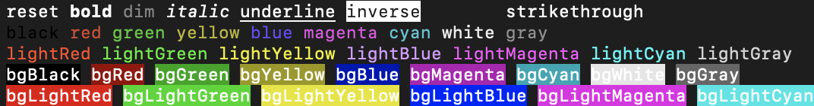

# Kolorist中文文档 {#kolorist-cndoc}

将颜色放入stdin/stdout极小的工具库🎉



## 用法

```shell
npm install --save-dev kolorist
```

```js
import { red, cyan } from "kolorist";

console.log(red(`Error: something failed in ${cyan("my-file.js")}.`));
```

你还可以通过以下环境变量来禁用或开启全局颜色。

- disable:

  - `NODE_DISABLE_COLORS`
  - `NO_COLOR`
  - `TERM=dumb`
  - `FORCE_COLOR=0`

- enable:
  - `FORCE_COLOR=1`
  - `FORCE_COLOR=2`
  - `FORCE_COLOR=3`

最重要的是您可以直接从node脚本中禁用颜色：

```js
import { options, red } from "kolorist";

options.enabled = false;
console.log(red("foo"));
// Logs a string without colors
```

你也可以从字符串中剔除颜色：

```js
import { red, stripColors } from "kolorist";

console.log(stripColors(red("foo")));
// Logs 'foo'
```

## 许可证

`MIT`, 请看[许可证文件](https://github.com/marvinhagemeister/kolorist/blob/main/LICENSE)
