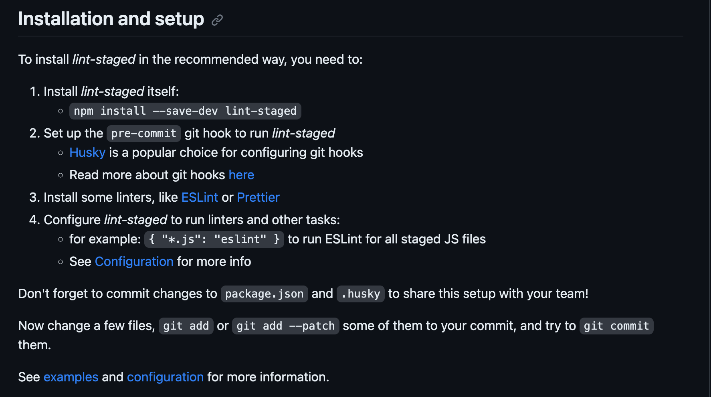

# Lint Staged

> 这是一个可以防止垃圾代码存入仓库的repo,通常可以搭配Git钩子+Linters(代码格式化)实现很好的效果。

&nbsp;&nbsp;例如在`pre-commit`时调用`lint-staged` bin可执行文件，那么每当我们提交文件到暂存区之前就会出现类似下面执行步骤

```
$ git commit

✔ Preparing lint-staged...
❯ Running tasks for staged files...
  ❯ packages/frontend/.lintstagedrc.json — 1 file
    ↓ *.js — no files [SKIPPED]
    ❯ *.{json,md} — 1 file
      ⠹ prettier --write
  ↓ packages/backend/.lintstagedrc.json — 2 files
    ❯ *.js — 2 files
      ⠼ eslint --fix
    ↓ *.{json,md} — no files [SKIPPED]
◼ Applying modifications from tasks...
◼ Cleaning up temporary files...
```

## 如何安装和配置？



## step1: install lint-staged of npm

```shell
npm install --save-dev lint-staged
```

## step2: 需要注册`git`钩子去运行`lint-staged`

推荐我们使用`husky`，那我们就用它，

> `Husky`提高了你的代码提交质量还有更多。
> 当您提交或推送时，您可以使用它来检查提交消息、运行测试、检查代码等。Husky 支持[所有客户端Git钩子](https://git-scm.com/docs/githooks)。

快速初始化`husky`

```shell
npx husky-init && npm install
```

::: details 它将做以下事情：

1. 添加`prepare`脚本到`package.json`，
   > 当首次拉取仓库到本地需要先执行`npm run prepare`来做预备工作

```json
{
  "scripts": {
    "prepare": "husky install"
  }
}
```

2. 创建一个普通`pre-commit`钩子，你能编辑它（默认在你提交时会执行`npm test`）
3. 配置Git hooks路径

使用`husky add`去添加其他钩子，例如：

```shell
npx husky add .husky/commit-msg 'npx --no -- commitlint --edit "$1"'
```

:::

因为我们要用`lint-staged`所以可以修改.husky/pre-commit文件为如下内容：

```shell
#!/usr/bin/env sh
. "$(dirname -- "$0")/_/husky.sh"   // [!code --]
. "$(dirname "$0")/_/husky.sh"  // [!code ++]

npm test    // [!code --]
npx lint-staged // [!code ++]
git add ./  // [!code ++]
```

::: warning
第一行这是一种特殊的注释语法，常见于脚本文件的开头。它用于指定脚本在运行时使用的解释器。
像`#!/usr/bin/env sh`也可用`#!/bin/sh`来代替

具体解释如下：

- `#!` 表示文件的Shebang（也称为Hashbang），用于告诉操作系统该脚本文件的解释器位置。
- `/bin/sh` 是指定使用的Shell解释器的绝对路径。在大多数UNIX/Linux系统中，/bin/sh 是指向默认的Bourne Shell或其兼容性版本的链接。
- `/usr/bin/env` 是一个命令，用于在执行环境的 $PATH 搜索路径中查找并运行指定的程序。
  :::

上面执行`npx lint-staged`后又执行了`git add ./`的原因是因为后面会触发lint-staged中配置的条件，调用linter的格式化功能。

因此会将文件重新写入，而这时重新写入的文件仍然处于Modify的状态，所以要将其添加到暂存区

### problem

你可能会遇到husky不能执行，不知道为什么？

> hint: The '.husky/pre-commit' hook was ignored because it's not set as executable.

解决：可能是权限不够，无法执行此文件，我们需要将其修改为可执行文件

```shell
chmod +x .husky/pre-commit
```

## step3: 安装linter --> `Prettier`

<p><a href="../prettier/summary" target="_blank">点我查看Prettier格式化工具如何使用</a></p>

## step4: 配置`lint-staged`去运行`linters`和其他任务

- 打开`package.json`并将类似以下内容写入
  ::: warning
  配置属性名可以根据`Glob`文件路径匹配模式的语法规范来写
  :::

```json
{
  "lint-staged": {
    "*.{js,md,ts,vue,json}": ["prettier --write"]
  }
}
```

- 或者忽略上面一条配置方式，创建一个`.lintstagedrc`文件并写入类似以下内容

```
{
  "*.{js,md,ts,vue,json}": [
    "prettier --write"
  ]
}
```

---

> 这个配置将用当前暂存后的文件作为参数去执行`prettier --write`
> 所以，考虑到您这样做`git add file1.ext file2.ext`，`lint-staged`将运行以下命令

```shell
prettier --write file1.ext file2.ext
```
