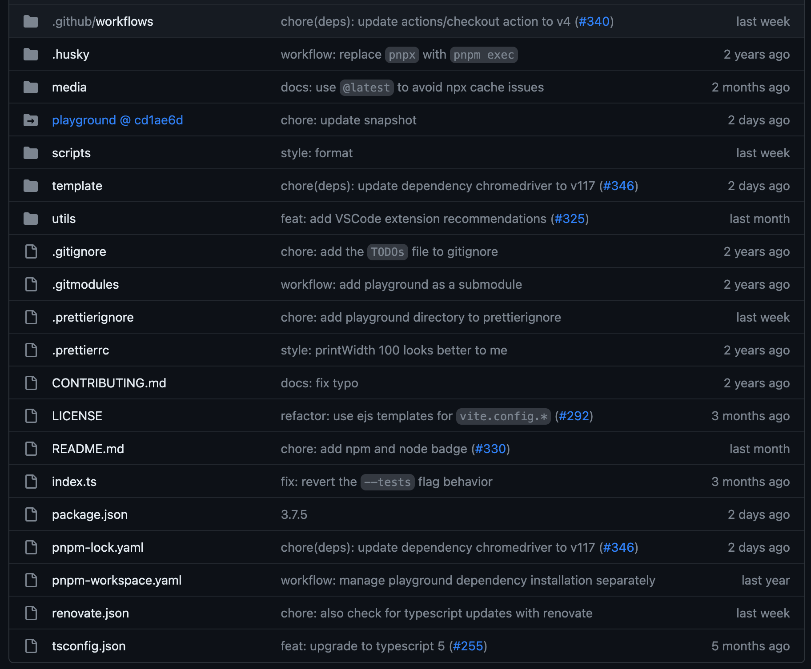

# create-vue

Github Reponsitory: https://github.com/vuejs/create-vue/tree/main

`create-vue`是一个基于Vite脚手架搭建的多种Vue项目模版，

我们可以调用以下命令安装并且会出现一些命令提示符形式的选项

```shell
npm create vue@latest
```

下面是运行的大致过程CLI截图，此工具可以让我们有选择的创建项目，不过影响不大，如果一个插件在之后需要用到再用包管理工具去装就好了

<p align="center">
  
</p>

## 项目目录

<p align="center">
  
</p>

目录分析：

- `.github/workflows` 用于Github仓库的一种自动化action工具，例如当你搭建了一个VitePress博客仓库，那么可以在代码推送后采用Github Actions去自动化构建和部署项目

- `.husky` 提供git的所有hooks，这里方便在每次commit前一刻调用pre-commit脚本

- `media` 像图片音视频素材都可以存到这里

- `playground @ cd1ae6d` 可以通过[子模块](https://zhuanlan.zhihu.com/p/143100657)或[子树](https://zhuanlan.zhihu.com/p/143100657)来嵌入其他的项目。这种方式可以使你的项目包含其他项目的代码，并且可以保持这些嵌入项目的独立性和版本控制。

- `scripts` 方便操作的可执行脚本通常放到这里

- `template` 根据开发者安装时CLI选项来将制定模版合并到创建的项目中

- `utils` 工具脚本存放位置
