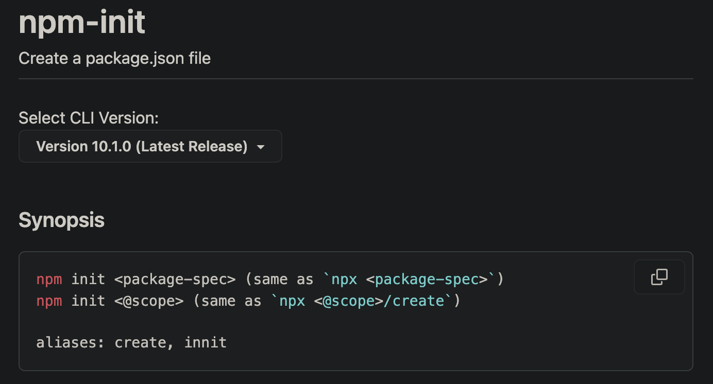
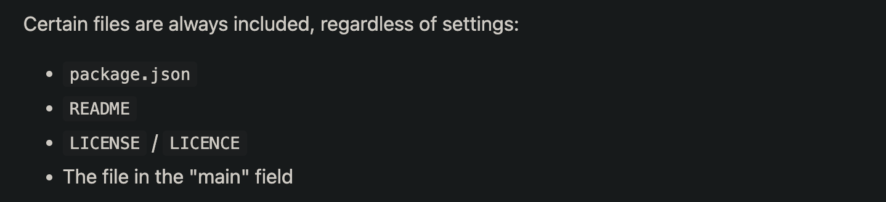

# create-vue

Github Reponsitory: https://github.com/vuejs/create-vue/tree/main

`create-vue`是一个基于Vite脚手架搭建的多种Vue项目模版，

我们可以调用以下命令安装并且会出现一些命令提示符形式的选项

```shell
npm create vue@latest
```

下面是运行的大致过程CLI截图，此工具可以让我们有选择的创建项目，不过影响不大，如果一个插件在之后需要用到再用包管理工具去装就好了

<p align="center">
  
</p>

## npm create vue@latest



它会执行 npm 包管理器中的 `create-vue` 包。`npx` 是 npm 5.2.0 版本引入的工具，用于直接执行项目依赖中的可执行文件。

<font color="#f2d478"><b>当你运行 `npx create-vue@latest` 命令时，npm 会下载并执行 `create-vue` 包中的可执行文件</b></font>，该文件负责创建一个新的 Vue.js 项目。`create-vue` 是一个官方提供的用于快速创建 Vue.js 项目的工具包。

## project directory

<p align="center">
  
</p>

**目录分析**：

- `.github/workflows` 用于Github仓库的一种自动化action工具，例如当你搭建了一个VitePress博客仓库，那么可以在代码推送后采用Github Actions去自动化构建和部署项目

- `.husky` 提供git的所有hooks，这里方便在每次commit前一刻调用pre-commit脚本

- `media` 像图片音视频素材都可以存到这里

- `playground @ cd1ae6d` 可以通过[子模块](https://zhuanlan.zhihu.com/p/143100657)或[子树](https://zhuanlan.zhihu.com/p/143100657)来嵌入其他的项目。这种方式可以使你的项目包含其他项目的代码，并且可以保持这些嵌入项目的独立性和版本控制。

- `scripts` 方便操作的可执行脚本通常放到这里

- `template` 根据开发者安装时CLI选项来将制定模版合并到创建的项目中

- `utils` 工具脚本存放位置

- `.gitignore` 在使用git提交代码时设置哪些可以忽略不提交

- `.gitmodules` git子模块配置文件

- `.prettierignore` Prettier格式化工具在格式化时所需忽略的文件

- `.prettierrc` Prettier格式化配置文件

- `LICENSE` 当前仓库的开源协议，例如MIT、GPL、Apache、BSD...

- `tsconfig.json` ts项目配置文件，如果图方便可以使用[@tsconfig/node18](https://www.npmjs.com/package/@tsconfig/node18)提供的公用配置文件来作为扩展，

```json
{ "extends": "@tsconfig/node18/tsconfig.json" }
```

## file analysis

关于文件分析具体内容请往下看

- [.gitmodule](#.gitmodule)
- [.prettierignore](#.prettierignore)
- [package.json](#package.json)
- [tsconfig.json](#tsconfig.json)

## xx.gitmodule {#.gitmodule}

```shell
[submodule "playground"]
	path = playground
	url = https://github.com/vuejs/create-vue-templates.git
```

在上面文件中，可以看出定义了一个子模块名叫`playground，之后分别指定了path&url，非常简单的一个文件

## xx.prettierignore {#.prettierignore}

```shell
pnpm-lock.yaml

# prettier doesn't respect newlines between chained methods
# https://github.com/prettier/prettier/issues/7884
**/*.spec.js
**/*.spec.ts
**/dist
# https://github.com/prettier/prettier/issues/5246
**/*.html

playground
```

在这个文件中指定了一些无意义无需格式化的文件及目录，

其中

- `pnpm-lock.yaml` 本身就是自动生成的文件，像格式也理应不发生变化否则后续可能会出一些依赖的问题，
- `playground` 这是子模块负责的板块，理应子模块负责

## xx.package.json {#package.json}

```json
{// [!code focus]
  "name": "create-vue",
  "version": "3.7.5",
  "description": "An easy way to start a Vue project",
  "type": "module", // [!code focus]
  "bin": {// [!code focus]
    "create-vue": "outfile.cjs" // [!code focus]
  }, // [!code focus]
  "files": [// [!code focus]
    "outfile.cjs", // [!code focus]
    "template" // [!code focus]
  ], // [!code focus]
  "engines": {
    "node": ">=v16.20.0"
  },
  "scripts": {// [!code focus]
    "prepare": "husky install", // [!code focus]
    "format": "prettier --write .", // [!code focus]
    "build": "zx ./scripts/build.mjs", // [!code focus]
    "snapshot": "zx ./scripts/snapshot.mjs", // [!code focus]
    "pretest": "run-s build snapshot", // [!code focus]
    "test": "zx ./scripts/test.mjs", // [!code focus]
    "prepublishOnly": "zx ./scripts/prepublish.mjs" // [!code focus]
  }, // [!code focus]
  "repository": {
    "type": "git",
    "url": "git+https://github.com/vuejs/create-vue.git"
  },
  "keywords": [],
  "author": "Haoqun Jiang <haoqunjiang+npm@gmail.com>",
  "license": "MIT",
  "bugs": {
    "url": "https://github.com/vuejs/create-vue/issues"
  },
  "homepage": "https://github.com/vuejs/create-vue#readme",
  "devDependencies": {// [!code focus]
    "@tsconfig/node18": "^18.2.2", // [!code focus]
    "@types/eslint": "^8.44.2", // [!code focus]
    "@types/node": "^18.17.17", // [!code focus]
    "@types/prompts": "^2.4.4", // [!code focus]
    "@vue/create-eslint-config": "^0.3.2", // [!code focus]
    "@vue/tsconfig": "^0.4.0", // [!code focus]
    "ejs": "^3.1.9", // [!code focus]
    "esbuild": "^0.18.20", // [!code focus]
    "esbuild-plugin-license": "^1.2.2", // [!code focus]
    "husky": "^8.0.3", // [!code focus]
    "kolorist": "^1.8.0", // [!code focus]
    "lint-staged": "^14.0.1", // [!code focus]
    "minimist": "^1.2.8", // [!code focus]
    "npm-run-all2": "^6.0.6", // [!code focus]
    "prettier": "^3.0.3", // [!code focus]
    "prompts": "^2.4.2", // [!code focus]
    "zx": "^7.2.3" // [!code focus]
  }, // [!code focus]
  "lint-staged": {// [!code focus]
    "*.{js,ts,vue,json}": [// [!code focus]
      "prettier --write" // [!code focus]
    ] // [!code focus]
  } // [!code focus]
}// [!code focus]
```

[点我查看npm package.json配置官方文档](https://docs.npmjs.com/cli/v9/configuring-npm/package-json)

上面文件中模糊部分是发布包到npm所需基本属性，我在此假借隐藏

- `type` 当你在包中有"type": "module"时。Json文件，你的源代码应该使用import语法。当你没有时，你应该使用require语法;也就是说，向包中添加"type": "module"。json启用ES 6模块。

- `bin` 在此添加的可执行文件，npm都会将其添加到**node_module/.bin**中，如果是安装的全局包-g，那么就可以直接在命令行调用可执行文件的名字来执行，如果是本地包，那么可以通过`.bin/my-executable`来执行或者`npx my-executable`

- `files` 在发布npm包时要提取哪些文件作为包文件，包括文件、目录或glob模式(*、**/*等)。省略该字段将使其默认为["*"]，这意味着它将包含所有文件。
  

- `devDependencies` 开发扩展包
  - `@tsconfig/node18` node18平台下通用tconfig扩展
  - `husky` 方便提供Git钩子
  - `prettier` 格式化文件，包含几十种文件的格式化
  - `esbuild` 这是一个JavaScript打包和压缩器
  - `esbuild-plugin-license` [插件]这使得使用esbuild构建后会输出特定第三方许可证
  - `zx` 面向前端的[Shell编程利器](https://gist.github.com/banyudu/3e700abb0c911caa9d40bc3c808de4d0)
  - `kolorist` 控制台输出信息含有颜色的工具
  - `lint-staged` git commit 时添加几道工序避免提交垃圾代码
  - `ejs` 高效的嵌入式 JavaScript 模板引擎。
  - `minimist` 当我们编写CLI脚本时，使用此工具可以帮助解析参数选项
  - `npm-run-all2` 可以同步或异步执行npm scripts
  - `prompts` 轻量级，美观和用户友好的交互式提示


- `scripts` 包含的快捷指令脚本，可以使用 **npm run run-script** 来调用
  - `prepare` 本地初始化husky
  - `format` 调用prettier写入功能格式化所有文件
  - `"prepublishOnly": "zx ./scripts/prepublish.mjs"` 通过zx调用基于zx预发布功能，如果文件开头写了#!/usr/bin/env zx，那么可以直接通过文件名字来调用，也可以zx filename来调用 

- `lint-staged` lint-staged配置，详细请参考repo>[lint-staged](/plugin-using/lint-staged/summary.md)

## xx.tsconfig.json {#tsconfig.json}

```json{2}
{
  "extends": "@tsconfig/node18/tsconfig.json",
  "include": ["index.ts", "utils/**/*"],
  "compilerOptions": {
    "strict": false,
    "resolveJsonModule": true
  }
}
```

上面"extends"表示继承了来自"@tsconfig/node18"的通用配置信息，并在此基础上做修改
