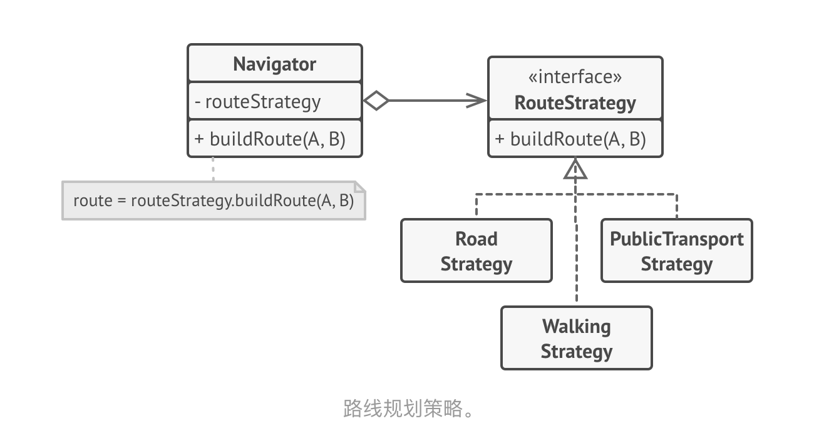

# Alternate If Syntax

> 灵感来源于“策略模式”，本篇文章代码使用JS来写

## 策略模式 {#strategy}

<p>
    
</p>

策略模式的大体概念：

<p>
    
</p>

## 代码实现 {#code-example}

```js
const resolve: Record<string, Function> = {
  false: () => {
    // console.log('用户的系统主题为黑暗');
  },
  true: () => {
    // console.log('用户的系统主题为光明');
  },
};

themeMode.value = !(
  window.matchMedia &&
  window.matchMedia("(prefers-color-scheme: dark)").matches
);

resolve[themeMode.value.toString()]();
```

## 使用true && ()()代替if语句

> 您也可以使用此方法来省略if语句，但它仅限于程序简单的地方，因为它的写法本身就不易于阅读。

下面是我在开发中写的用于： 处理允许使用的支付方式 的案例：

```js{5,20}
// 检测是否允许使用此方式支付
const result = allowPay.filter(
  (str) => (pay?.className.match(str) || []).length > 0,
);
result.length > 0 && (() => {
  pay?.classList.add(selectorable_name[0]);
  pay?.addEventListener(
    "click",
    _debounce(() => {
      clear_all_selector();

      pay?.classList.add(selector[0]);
      // 支付文字颜色
      pay?.classList.remove("text-[#9da3ae]");
      pay?.classList.replace("bg-base-300", selector[1]);

      props.callback && props.callback();
    }, 50),
  );
})();
```

<p align="right">本篇文章阅读大概用时：2min</p>
